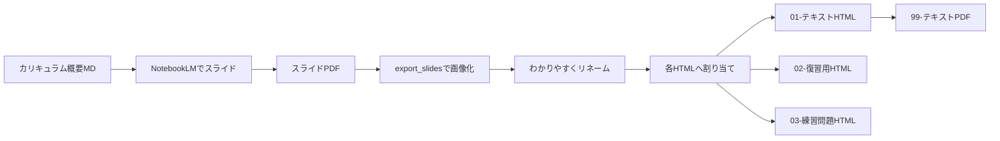

# コンテンツ制作パイプライン（概要→HTML/PDF/画像）

## 目的

このファイルは、各Unit教材を作るときの「標準手順」を1か所に集約するための記録用ドキュメントです。  
NotebookLMでスライドを作り、それを画像化して、`01-テキスト` / `02-復習用` / `03-練習問題` / `99-テキストpdf` に割り当てるまでの流れを示します。

## 全体フロー

## 標準手順（チェックリスト）

1. **カリキュラム概要MDを用意**
   - 入力元は `curriculum/units/unitXX.md`（各Unitの講義設計）
   - NotebookLMに投げる用の概要原稿（`unitXX-notebooklm-outline.md`）を別途作成する

2. **NotebookLMでスライドPDFを出力**
   - NotebookLMの出力は「スライドPDF」として一旦保存する
   - この段階では、まだHTMLには反映しない

3. **スライドPDFを画像化（JPG）**
   - `scripts/export_slides.py` を使って、全ページを画像（JPG）として書き出す
   - 生成先は `UnitXX_*/slides/` 配下（例: `Unit03_DAO/slides/`）

4. **画像をわかりやすくリネーム**
   - `unit03-slide-p01.jpg` のような一律名ではなく、見出し内容が分かる命名にする
   - ここで「どのHTMLのどの図か」が追える状態に整える

5. **画像を HTML（`01`/`02`/`03`）へ割り当て**
   - `01-テキスト` 本編に図・画像を配置
   - `02-復習用` と `03-練習問題` は必要な範囲だけ配置

6. **PDFを生成**
   - `01-テキスト`（またはその印刷用HTML）から `99-テキストpdf` を生成する

## Unit03（DAOパターン）での具体例

- Unitフォルダ: `Unit03_DAO/`
- NotebookLM概要MD: `curriculum/units/unit03-notebooklm-outline.md`
- 図ソース: `diagrams/03-DAO/` を番号＋内容入りの英語ファイル名へリネームして `diagrams/00-exported/unit03/` に配置
  - 注: `Servlet` レイヤは図に含めない（Service/DAO/DBの範囲だけにする）
- スライド画像:
  - `Unit03_DAO/slides/` 配下へ `scripts/export_slides.py` で全ページJPGを書き出す
  - その後、内容が分かる名前にリネームしてHTMLに割り当てる
- PDF生成:
  - `99-テキストpdf-...pdf` は `scripts/build_unit03_dao_pdf.py` で生成（Unit02と同型）

## 命名・参照の注意（最低限）

- HTML本編は既存の命名規則に従う（`01-` / `02-` / `03-` / `99-` / `src/template.html`）
- 図の参照はHTML内で `raw URL`（またはプロジェクトが採用している既存方針）に合わせる

