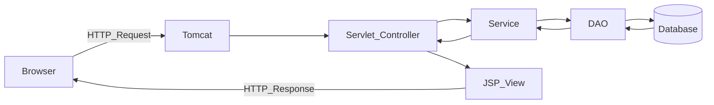
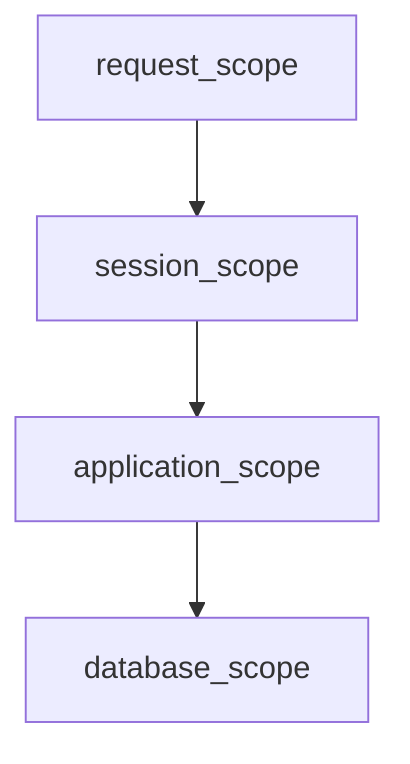

# Java Web Architecture Blueprint（修正版：文章＋図）

## この図の目的

- 学習者が **「データがどこから来て、どこを通って、どこに表示されるか」** を迷わないための地図。
- 本講座では、このフローを **暗記できる“型”** として反復し、Unitごとにパーツを増やして完成させる。

---

## 最重要：I/O（データの旅）黄金ルート

### 1往復（最小の形）

### 役割（最短）

- **Browser**: 送る（Request）／受け取る（Response）
- **Tomcat**: Webアプリを動かす箱（Servlet/JSPを動かす実行環境）
- **Servlet（Controller）**: 司令塔（受け取る→判断→処理へ渡す→結果をViewへ渡す）
- **Service**: 業務ルール（計算、判定、トランザクションのまとめ等）
- **DAO**: DBとの会話（SQL/JDBCをここに集約）
- **Database**: 永続データ（テーブル）
- **JSP（View）**: 表示（Servletから渡されたデータをHTMLに埋める）

---

## スコープ／状態管理（段階導入）

講座では次の順で「寿命」と「共有範囲」を増やす。

- **request**: 1回の往復で消える（基本）
- **session**: ブラウザ単位で続く（Unit7で導入）
- **application**: サーバ全体で共有（Unit10で整理）
- **database**: 永続（常にここにある）

---

## ここで“間違えやすい点”（正しい理解だけ残す）

- **ServletはJSPの代わりではない**  
	- Servletは「司令塔」、JSPは「表示」。
- **DAOはServletの中に書かない**  
	- DB周りの変更点をDAOに集約して、影響範囲を小さくする。
- **JSPでDBへ行かない**  
	- JSPは表示に集中し、DBアクセスはDAOまでで止める。

